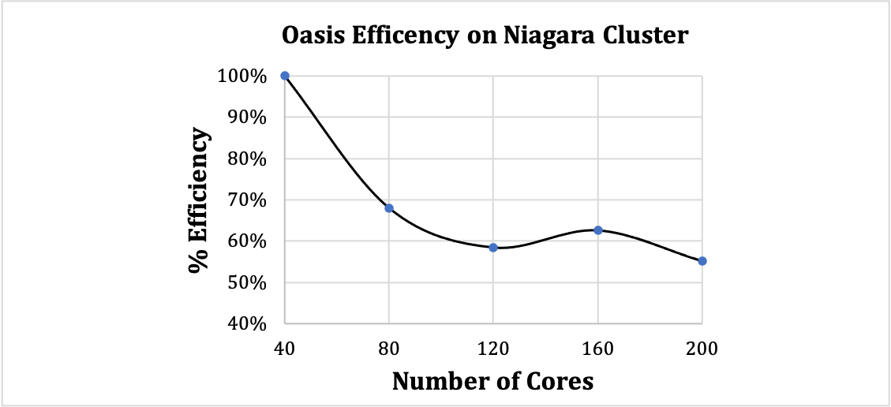

# OasisTools
The scripts in this repository provide useful tools to facilitate CFD simulations using the Oasis solver (https://github.com/mikaem/Oasis). You will need the following libraries to use these tools:
1. vtk
2. Fenics

If you have a mac, I recommend installing VTK first and then Fenics using the following commands:

```console
foo@bar:~$ conda create -n Fenics
foo@bar:~$ conda activate Fenics
foo@bar:~$ conda install vtk
foo@bar:~$ conda install -c conda-forge fenics
```

To get help for any script, please type:
```console
foo@bar:~$ python [ScriptName.py] -h
```
## Scaling of Oasis CFD Solver on Niagara Computing Cluster
### Introduction
*Oasis* is a high-performance CFD solver that has shown accuracy on par with state-of-the-art DNS solvers (e.g., NEK5000). The solver is minimally dissipative and energy preserving, ideal for high-resolutions simulations of transitional or turbulent blood flows in the cardiovascular system.

### Cluster Specification
Below, we have demonstrated the scaling of *Oasis* solver on SciNet's Niagara Compute Cluster. Each node on Niagara cluster has 40 Intel "Skylake" cores at 2.4 GHz and 88 GiB / 202 GB RAM per node.

### Test Problem
The scaling test was performed on an eccentric stenosis problem at Reynolds number of 1500, typical of those observed in the aorta (see [Khan et al., FTaC, 2018](https://link.springer.com/article/10.1007/s10494-018-9905-7)). The geometry and the mesh information is shown in the Figure 1. The model has a 5% eccentricity at the throat of the stenosis neck that acts as a geometric perturbation to destabalize the flow towards turbulence. The CFD simulations were run with 2.6 million tetrahedral element, with P2-P1 polynomial functions for velocity and pressure, which resulted in an effective mesh size of ~21 million elements. The Reynolds number was 1500 with a temporal resolution of 0.0005 seconds.  

*Figure1: Cross-sectional view of the tetrahedral mesh used in the study. **a)** Schematic of the stenosis model with the region of local refinement, 6D ≤ x ≤ 14D, marked with dashed line. I and II correspond to cut locations. **b)** and **c)** Cross-sectional cut of the mesh outside (i.e. I) and within (i.e. II) the region of local refinement, respectively. The inset shows boundary layer elements close to the wall. **d)** Plot of boundary layer resolution for cross-sectional cuts I (dashed line) and II (solid line).*

### Scaling Results
Simulations were run at 40, 80, 120, 160, 200 cores, corresponding to 1, 2, 3, 4 and 5 nodes on Niagara computing cluster. % Efficiency was computed relative to 40 core. As seen in Figure 2, Oasis scaling drops to 70% at 2 nodes and then lingers around 60% at >= 3 nodes. Hence, the optimal performance can be obtained at 1 Node (40 cores). However, if further speed gain is required, 2 Nodes can also be used with modest drop in efficiency. 

*Figure 2: Scaling test of Oasis on Niagara Compute Cluster with a stenotic mesh of 2.6 million elements run with P2-P1 polynomial function*


## SciNet Computing Cluster (Niagara) Script to Run Oasis
This script can be used to load specific modules and run Oasis on Niagara. Please ensure to modify this script as necessary. Specifically, change the following parameters in the script.

```#SBATCH --time=01:00:00```: The maximum allocated time to requested. Maximum allowed is 1 day.

```#SBATCH --nodes=1```: The number of nodes requested. Usually 1 or 2 are sufficient.

```#SBATCH --mail-user=youremailaddress@torontomu.ca```: You can provide an email address to be notified when your SciNet job starts or finishes.

```mesh_path```: Path to where you have stored the mesh.

## Convert SimVascular Mesh to Oasis readable Mesh
SimVascular software (see simvascular.github.io) can be used to segment and generate volumetric meshes. SimVascular produces a folder called "mesh-complete", which contains the volumetric, wall and cap meshes. Prior to generating the mesh in SimVascular, please ensure that the inflow cap is labelled as "inflow". 

The following script can be used to produce a VTU file that can be visualized in Paraview and .xml.gz file that can be read into Oasis CFD solver. Here is how to use the script.

```console
foo@bar:~$ python OasisMeshWriterForSimVascular.py -InputFolder /path/to/mesh-complete/ 
```
You may define the following parameters:
The script will output two files in the same folder as the /path/to/ (i.e. where mesh-complete folder is located). 
1. mesh-complete.vtu: A volumetric mesh file that can be read into paraview along with all of the boundary ids.
2. mesh-complete.xml.gz: A volumetric msh file that can be read into Oasis. Please refer to VaMPY documentation (https://github.com/KVSlab/VaMPy) on how to conduct simulations with the Oasis CFD solver.

**Note**: The CellEntityIds tag in the mesh correspond to: 0=volumetric mesh, 1=wall mesh, 2=inflow and 3...N for outflows.

**Note**: The VTU file is converted in .xml.gz file using the vmtkMeshWriter script. However, the conda installing of vmtk will give you an error. You will need to update the vmtkMeshWriter script manually to corrct this. Please open the vmtkmeshwriter.py file, go to line 264, and change ```file = open(self.OutputFileName,'r')``` to ```file = open(self.OutputFileName,'rb')```. If you install vmtk using conda, the script will be located at: ```/Users/[USERNAME]/miniconda3/envs/vmtk/lib/python3.6/site-packages/vmtk/vmtkmeshwriter.py```

## Convert SimVascular velocity to Oasis Readable velocity
The following script can be used to convert VTK format velocity field from SimVascular to .h5 format velocity field for Oasis. Converting SimVascular velocity field in .h5 format allows us to utilize FEniCS library for computing post-processing quantities (available in VaMPy see https://vampy.readthedocs.io/en/latest/).

First, convert the SimVascular mesh to FEniCS readable mesh. You can do this using any of the velocity output files from simvascular or the mesh used in the simvascular simulation. You will need to use VMTK to do this. For example:
```console
foo@bar:~$ vmtkmeshwriter -ifile mesh-complete.mesh.vtu -ofile mesh.xml"
```
Next, run the script to convert SimVascular results to Oasis results
```console
foo@bar:~$ python OasisConvertSimVascularResults.py -InputFolder /path/to/Simvascular/results -MeshFileName /path/to/mesh.xml.gz
```
Optional arguments include:
* -OutputFolder : Path to the output folder to store the .h5 results (Oasis format).

